<p align="center">
  
</p>

<p align="center">
  <a href="LICENSE"></a>
  <a href="https://github.com/tobfd/tsuzuki/actions/workflows/ci.yml"></a>
  
  
  
</p>

# Tsuzuki for AniList

**Tsuzuki** (続き, "what comes next") is a native Android client for [AniList](https://anilist.co): your anime and manga lists, what you are watching and reading, and what comes next, in an app that feels at home on Android. Built with Kotlin, Jetpack Compose and Material 3.

> [!NOTE]
> Tsuzuki is an unofficial app. It is not affiliated with, endorsed or sponsored by AniList. "AniList" is used only to say which service the app works with; all data comes from the [AniList API](https://docs.anilist.co).

## Features

- **Home:** In Progress with +1, what to start next from Planning, Trending now and the activity feed of the people you follow (or everyone).
- **Lists, offline first:** your anime and manga lists live on the device, open instantly and work without a connection. +1, status, score and the full list editor save at once and are sent in order when you are back online, with undo and a clear message if AniList rejects a change. Custom lists, sorting, filters and search.
- **Detail pages:** score, ranking, description, genres and tags, where to watch, relations, characters with voice actors, staff, stats and recommendations. Share your progress as a story or square image.
- **Browse:** search with filters (format, status, season, year, genres, tags, sort) and quick chips for Trending, Top 100, This season and more. Character and staff pages.
- **Profiles:** yours and other users', with stats, activity history, favourites and lists.
- **Notifications** with filters and grouped likes.
- **Widgets:** In Progress with +1, a countdown to the next episode, and your friends' activity.
- **Made for Android:** Material You (dynamic color) or AniList blue, light, dark and pure black, edge to edge, predictive back, adaptive layouts for tablets and foldables, English and German with a per-app language.
- **Respects your AniList settings:** title language, score format (all five), staff name language and adult content (hidden by default).
- **Browse without an account:** search and read detail pages as a guest.

## Screenshots

| Home | Lists | Detail | Share | Browse | Profile | Widgets |
|:---:|:---:|:---:|:---:|:---:|:---:|:---:|
| 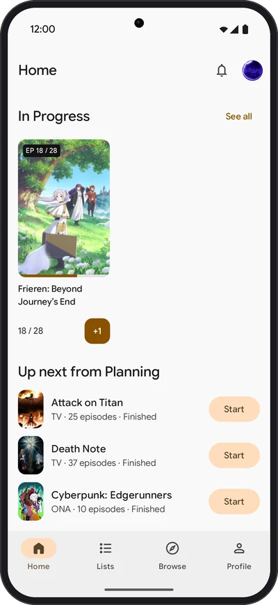 | 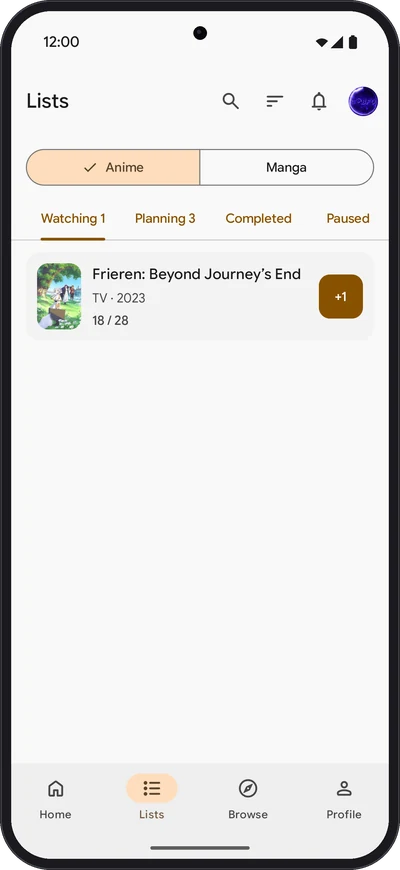 | 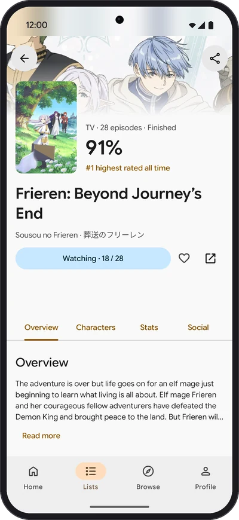 | 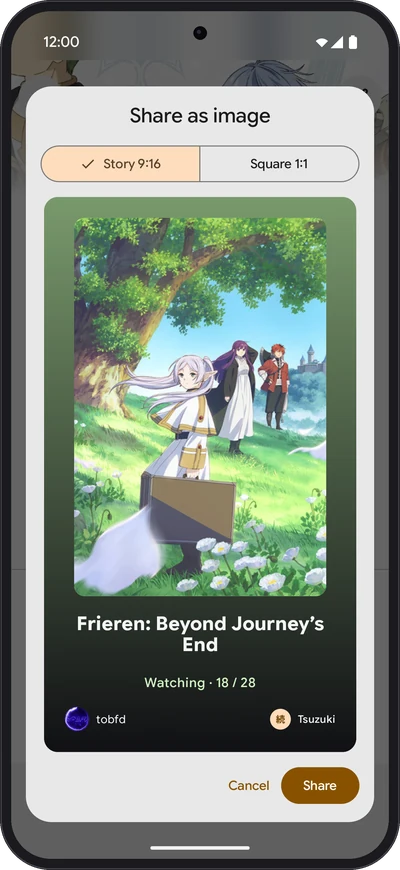 | 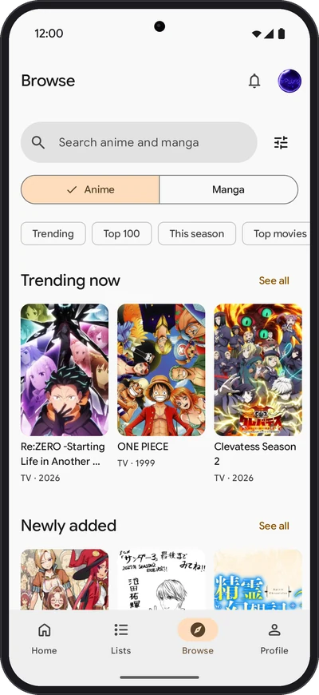 | 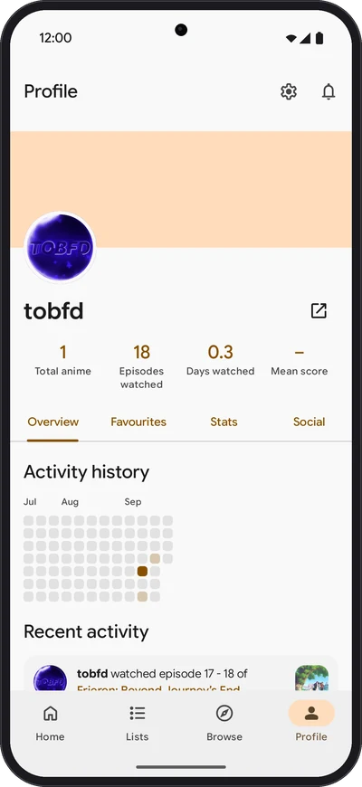 | 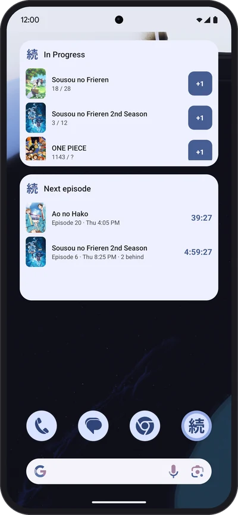 |
| 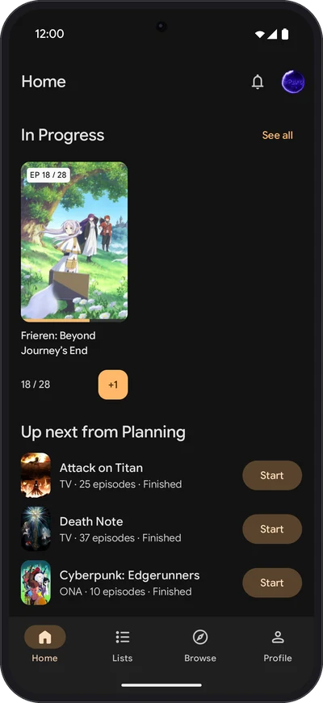 | 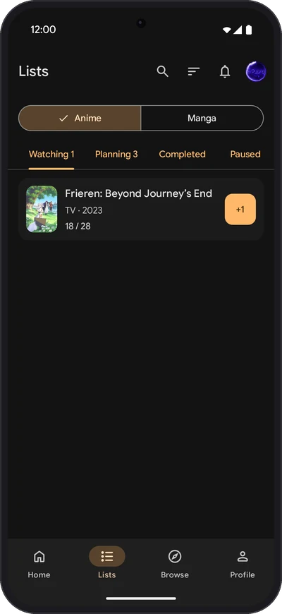 | 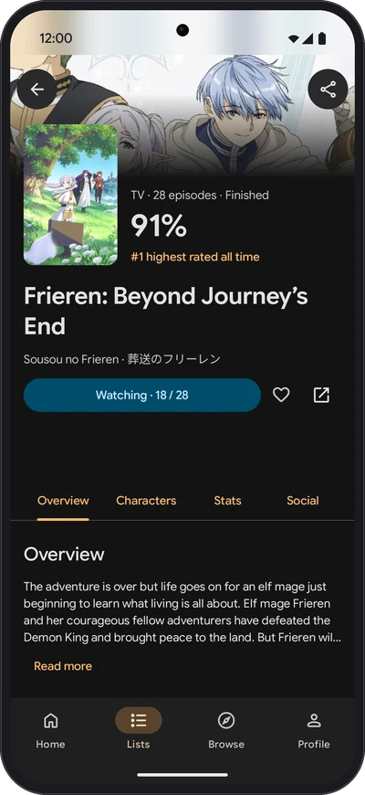 | 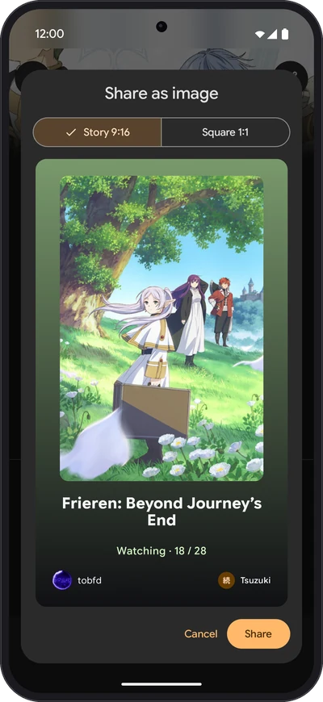 | 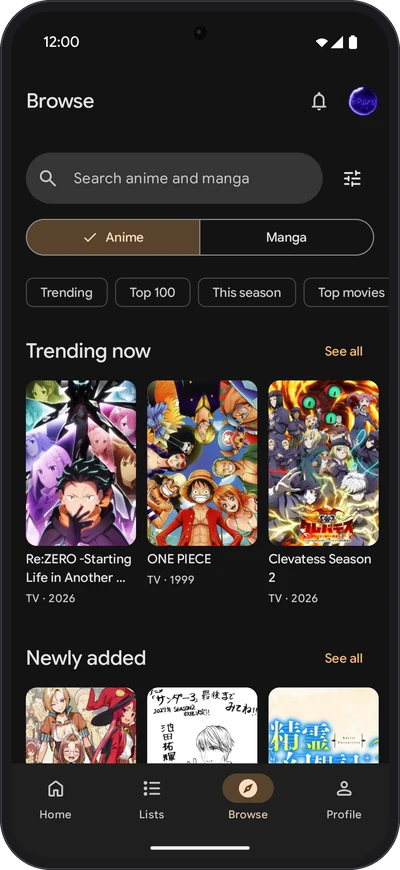 | 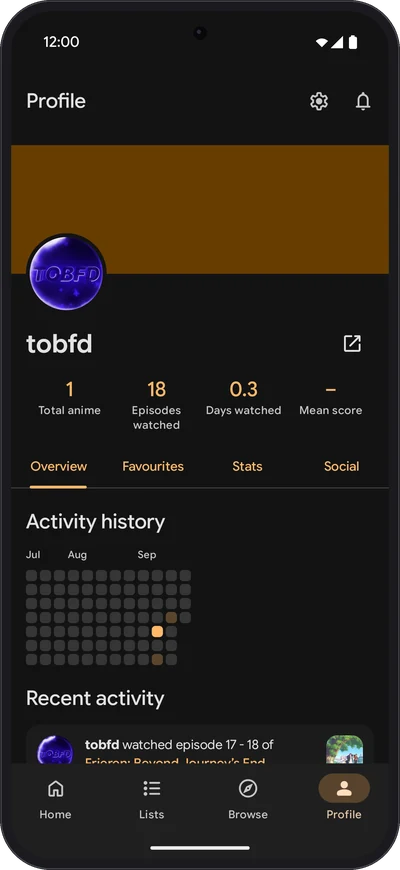 | 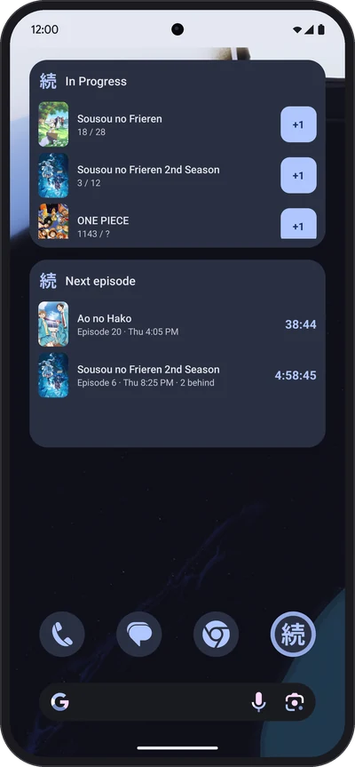 |

On tablets and foldables, lists and details sit side by side:

<p align="center">
  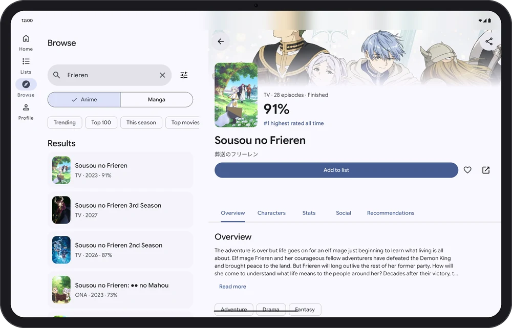
  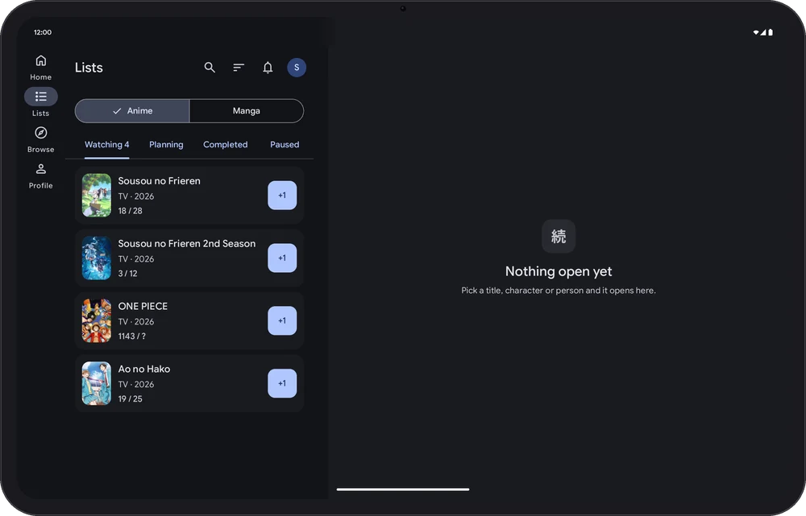
</p>

All widgets, here with sample data:

<p align="center">
  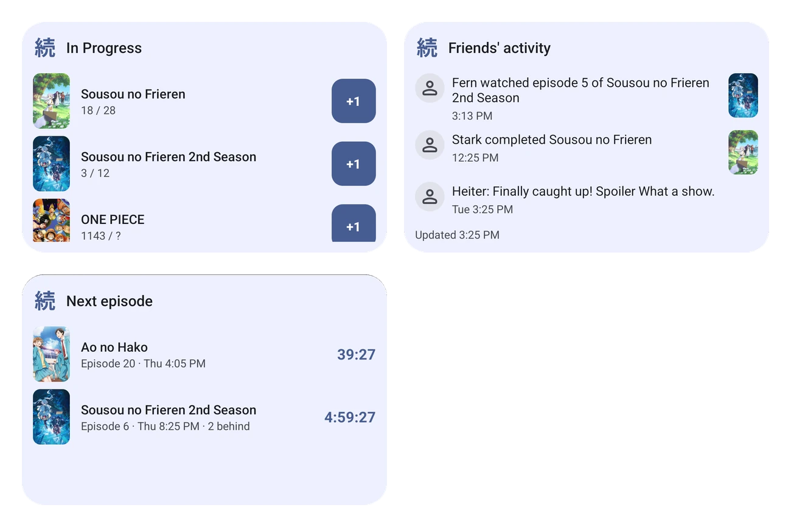
  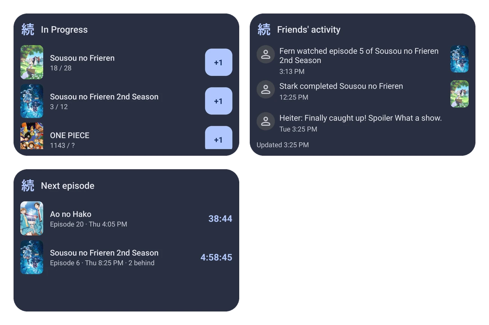
</p>

Phone screenshots come from a real account on a Pixel 9, tablet and widget screenshots from the emulator. Store-ready images live in [`docs/images/store`](docs/images/store), plain screenshots in [`docs/images/screenshots`](docs/images/screenshots).

## Tech stack

| Area | What |
|---|---|
| Language | Kotlin (K2), Coroutines and Flow, kotlinx.serialization |
| UI | Jetpack Compose, Material 3, `material3-adaptive` and the navigation suite, Google Sans Flex, Material Symbols |
| Navigation | Navigation 3: a back stack per tab, list-detail scenes on large screens, predictive back |
| Network | Apollo Kotlin 5 with the normalized cache (memory + SQLite), OkHttp with auth and rate-limit interceptors |
| Local data | Room 3 (offline lists and the queue of pending changes), DataStore, Tink for the encrypted token |
| Background | WorkManager: sends queued changes, syncs lists, updates widgets |
| Widgets | Jetpack Glance |
| Images | Coil 3 |
| DI | Hilt |
| Build | Gradle version catalog, convention plugins in `build-logic`, Spotless + ktlint, R8 full mode, Baseline Profiles |
| Tests | JUnit, Turbine, Robolectric, Compose UI tests, Apollo test transport, hand-written fakes |

The app is split into `core/*` modules (model, network, database, data, design system, shared UI) and one module per feature under `feature/*`. [`CLAUDE.md`](CLAUDE.md) describes the architecture and the rules for the codebase.

## Build from source

You need Android Studio (latest stable) or just a JDK 17+ for the Gradle wrapper; Gradle downloads the JDK 25 it runs on by itself.

1. Register your own API client at [anilist.co/settings/developer](https://anilist.co/settings/developer):
   - Name: anything you like, e.g. `Tsuzuki (dev)`
   - Redirect URL: `tsuzuki://auth`
2. Put its client ID into `local.properties` in the project root (git-ignored, never commit it):
   ```properties
   anilist.clientId=12345
   ```
   Without it, the build stops with a message that says what to add.
3. Build and install on a device or emulator with Android 12 or newer:
   ```bash
   ./gradlew installDebug
   ```

Other useful commands:

```bash
./gradlew testDebugUnitTest             # unit tests
./gradlew connectedDebugAndroidTest     # Compose UI tests (emulator with API 36)
./gradlew spotlessApply                 # format Kotlin, Gradle scripts and XML
./gradlew spotlessCheck build           # what CI runs
```

Debug builds log every AniList request (never the token) under the logcat tag `AniListRequest`, and contain a component catalog: tap the version in Settings > About seven times.

## Roadmap and ideas

v1 is feature complete. Ideas for later (see [`docs/PRODUCT.md`](docs/PRODUCT.md)):

- Replying to activities and writing status posts
- Forum (reading first) and reviews
- Detailed stats pages, managing favourites, followers and following
- Local episode reminders and system notifications for AniList notifications
- Opening anilist.co links in the app
- A Wear OS companion with a tile and a complication ([assessment](docs/WEAR_OS.md))
- M3 Expressive motion once Material 3 1.5 is stable

## Contributing

Bug reports and ideas are welcome as [issues](https://github.com/tobfd/tsuzuki/issues). For code, read [`CONTRIBUTING.md`](.github/CONTRIBUTING.md) first.

## Docs

- [`docs/PRODUCT.md`](docs/PRODUCT.md): decisions and scope
- [`docs/ROADMAP.md`](docs/ROADMAP.md): milestones
- [`docs/ANILIST_API.md`](docs/ANILIST_API.md): how the app talks to AniList (rate limit, errors, pagination)
- [`docs/DESIGN.md`](docs/DESIGN.md) and [`design/tokens.json`](design/tokens.json): design system and screens

## License

Tsuzuki is free software: you can redistribute it and/or modify it under the terms of the [GNU General Public License v3.0](LICENSE).

Third-party libraries and assets keep their own licenses (Apache 2.0, MIT, BSD 3-Clause and the SIL Open Font License 1.1 for Google Sans Flex and the Noto Sans JP glyph in the icon); the app lists them under Settings > About > Open-source licenses.

Anime and manga data, covers and banners come from AniList and belong to their respective owners.
