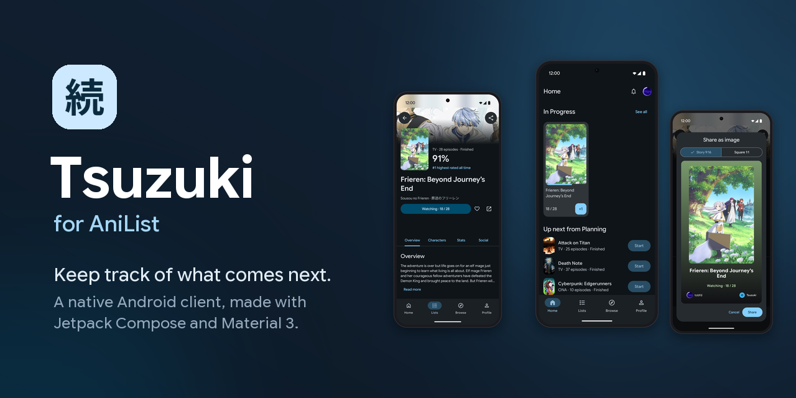
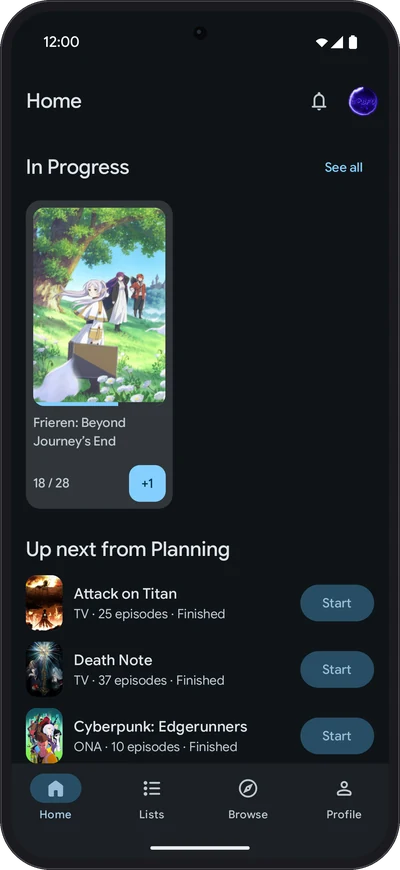
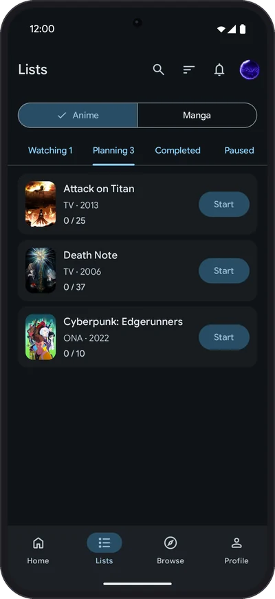
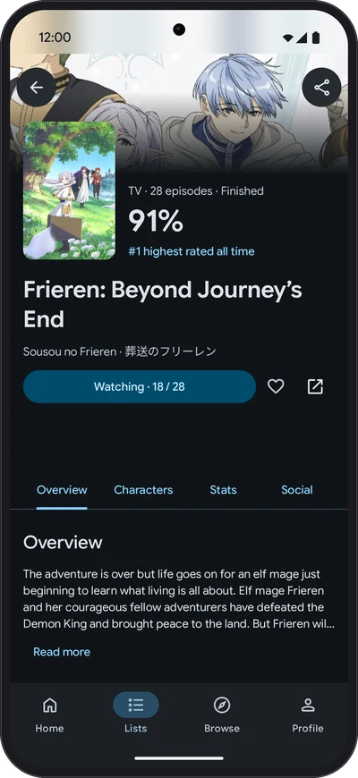
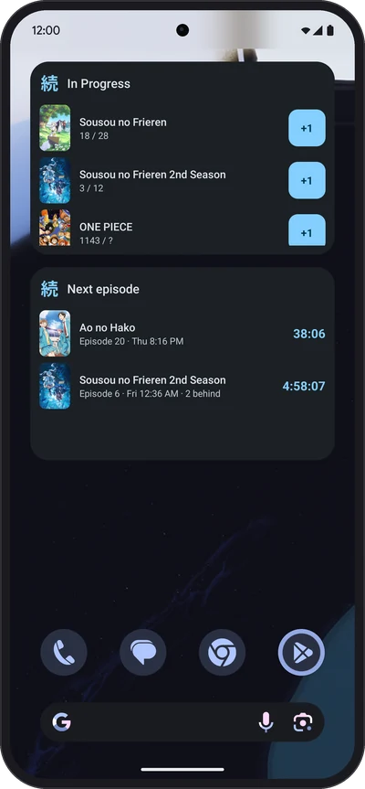

<p align="center">
  
</p>

<p align="center">
  <a href="https://github.com/tobfd/tsuzuki/releases/latest"></a>
  <a href="https://github.com/tobfd/tsuzuki/actions/workflows/ci.yml"></a>
  <a href="LICENSE"></a>
  
</p>

**Tsuzuki** (続き, "what comes next") is a native Android client for [AniList](https://anilist.co): your anime and manga lists, what you are watching right now and what comes next, built with Jetpack Compose and Material 3.

<p align="center">
  
  
  
  
</p>

## Features

- **+1 in one tap** from Home, the lists and a home-screen widget, with undo.
- **Offline first:** your lists live on the device; changes are sent when you are back online.
- **Detail pages** with characters, staff, stats, where to watch and a share card.
- **Browse** with search, filters, trending and this season.
- **Notifications** for new episodes and AniList activity, switchable per kind in Android's settings.
- **Material You or AniList blue**, light, dark and pure black, tablets and foldables, English and German.

## Download

Get the APK from the [latest release](https://github.com/tobfd/tsuzuki/releases/latest) (Android 12 or newer).

## Build from source

1. Create an API client at [anilist.co/settings/developer](https://anilist.co/settings/developer) with the redirect URL `tsuzuki://auth`.
2. Put its ID into `local.properties` in the project root (git-ignored):
   ```properties
   anilist.clientId=12345
   ```
3. Run `./gradlew installDebug` with a device or emulator connected.

Any JDK 17+ starts the Gradle wrapper; Gradle fetches the JDK it runs on itself. [`CONTRIBUTING.md`](.github/CONTRIBUTING.md) and [`CLAUDE.md`](CLAUDE.md) explain how the code is organized.

## Disclaimer

Tsuzuki is an unofficial app and not affiliated with, endorsed or sponsored by AniList. Anime and manga data, covers and banners come from the [AniList API](https://docs.anilist.co) and belong to their respective owners.

## License

[GNU General Public License v3.0](LICENSE). Third-party licenses are listed in the app under Settings > About > Open-source licenses.
